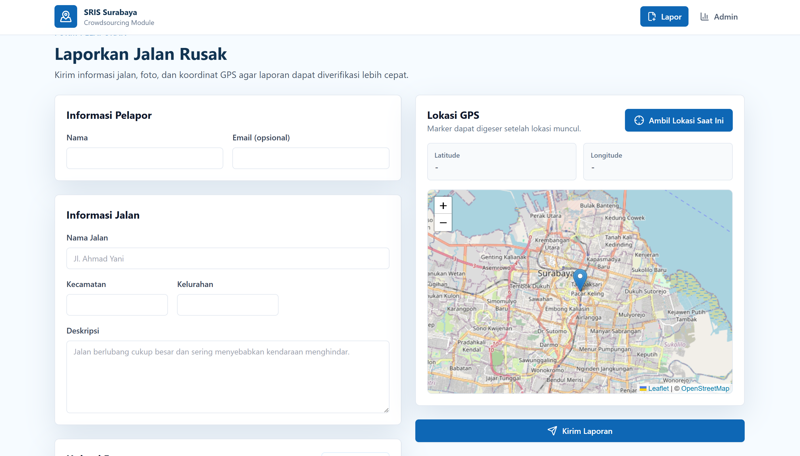

# Smart Road Intelligence System (SRIS) - Crowdsourcing Module

*(Untuk petunjuk instalasi teknis, panduan run Docker, dan detail dokumentasi API, silakan merujuk pada dokumen terpisah: **[Petunjuk_Pengguna.md](./docs/Petunjuk_Pengguna.md)**)*

## Anggota Kelompok & Kontribusi

| No | Nama | NRP |
|----|------|-----|
| 1 | Putu Yudi Nandanjaya Wiraguna | 5027241080 |
| 2 | M. Alfaeran Auriga Ruswandi | 5027241115 |
| 3 | Fika Arka Nuriyah | 5027241071 |
| 4 | Christiano Ronaldo Silalahi | 5027241025 |
| 5 | S. Farhan Baig | 5027241097 |

---

## Topik yang Dipilih

**"Pembangunan Sistem Crowdsourcing Cerdas Berbasis Big Data Lakehouse untuk Pelaporan dan Prediksi Risiko Kerusakan Infrastruktur Jalan Raya di Kota Surabaya"**

---

# Laporan Akhir Final Project: Big Data Lakehouse & Smart Road Monitoring

## 1. Daftar Dokumen Pemenuhan CPMK
Sebagai bentuk pertanggungjawaban atas perancangan dan implementasi sistem sesuai dengan rubrik penilaian Final Project, berikut adalah daftar ringkasan pemenuhan Capaian Pembelajaran Mata Kuliah (CPMK) beserta rasionalisasi arsitektur dan logikanya:

### CPMK 1: Identifikasi Masalah & Rancangan Ekosistem Big Data
* **Dokumen:** [Identifikasi_Masalah.md](./docs/Identifikasi_Masalah.md)
* **Struktur & Workflow:** Dokumen ini menjabarkan akar permasalahan terkait lambatnya penanganan jalan rusak di Kota Surabaya dan mengusulkan solusi berbasis *crowdsourcing* yang dikombinasikan dengan kecerdasan buatan. Workflow bermula dari pengumpulan data pelaporan secara masif melalui antarmuka web, divalidasi oleh deteksi YOLOv8, dan diakhiri dengan peringkasan analitik.
* **Alasan & Logika Keputusan:** Pendekatan hibrida (pelaporan warga + validasi AI) sangat krusial karena data kerusakan jalan sangat dinamis dan rawan pelaporan palsu. Membangun infrastruktur *Big Data* diputuskan menjadi syarat mutlak karena volume data pelaporan, integrasi data cuaca, dan data lalu lintas (*IoT streams*) diprediksi akan melonjak secara eksponensial di masa depan (*Volume, Velocity, Variety*).

#### Rancangan Workflow Ekosistem Keseluruhan (End-to-End)
Sebagai realisasi dari identifikasi masalah di atas, berikut adalah kronologi aliran data sistem dari hulu ke hilir beserta arsitektur detail di setiap fasenya:


1. **Fase Ingesti (Data Capture & Validation):** Pengguna mengirim laporan beserta foto jalan rusak melalui antarmuka **React Frontend**. Laporan ini diterima oleh **FastAPI Backend**, di mana foto tersebut langsung diumpankan ke model Computer Vision **YOLOv8** untuk klasifikasi jenis kerusakan (*Pothole/Crack*) dan perhitungan tingkat keparahan awal (*Severity Score*).

   
2. **Fase Streaming (Message Broker):** Setelah tervalidasi, FastAPI bertindak sebagai *Producer* dan mengirimkan *payload* data tersebut ke dalam ekosistem **Apache Kafka**. Kafka berfungsi sebagai *buffer* kecepatan tinggi untuk menampung aliran data pelaporan, serta data simulasi dari cuaca dan kemacetan lalu lintas, memastikan sistem tidak runtuh saat terjadi lonjakan *traffic*.
3. **Fase Lakehouse - Bronze Layer (Raw Storage):** Klaster **Apache Spark (Structured Streaming)** menyedot data dari topik Kafka secara konstan dan langsung menyimpannya ke dalam **Apache Hadoop (HDFS)** dalam format Parquet. Pada layer Bronze ini, data disimpan persis seperti aslinya sebagai rekam jejak historis yang *immutable*.
4. **Fase Lakehouse - Silver Layer (Cleansing & Standardization):** Spark kembali membaca data Bronze, melakukan proses pembersihan (menghilangkan *null values*, standarisasi teks), serta penggabungan (*join*) data laporan dengan data cuaca dan lalu lintas. Data yang bersih ini kemudian ditulis kembali ke HDFS di Silver Layer.
5. **Fase Lakehouse - Gold Layer (Machine Learning & Aggregation):** Menggunakan fitur analitik prediktif dari **PySpark MLlib (Random Forest)**, Spark menghitung skor risiko kecelakaan dan memformulasikan *Priority Score* (Rekomendasi Perbaikan Prioritas) serta *Road Health Index* (Indeks Kesehatan Jalan). Data matang ini kemudian di-*load* ke tabel *serving* di dalam **PostgreSQL**.
6. **Fase Serving & Visualisasi:** Terakhir, *dashboard* admin **React** akan menarik (*fetch*) data analitik yang telah diolah oleh Spark dari PostgreSQL melalui *endpoint* FastAPI, menampilkan wawasan analitik secara interaktif dan visual kepada instansi pemerintah secara *real-time*.

   

**Snippet Kode (Deteksi AI YOLOv8 sebagai Gerbang Data):**
```python
# backend/app/services/yolo_service.py
def predict_damage(image_path: str):
    results = model(image_path)
    best_conf = 0.0
    best_class = "Unknown"
    for r in results:
        for box in r.boxes:
            conf = float(box.conf[0])
            if conf > best_conf:
                best_conf = conf
                best_class = model.names[int(box.cls[0])]
    return best_class, best_conf
```

**[Hasil Run - CPMK 1]**
> *Log Eksekusi Terminal (YOLOv8 Inference Request):*
> ```text
> PS D:\FP_BIGDATA> curl.exe -X POST "http://localhost:8000/predict" -H "accept: application/json" -H "Content-Type: multipart/form-data" -F "file=@jalan_berlubang_parah.jpg"
> 
> {"damage_type":"D40_Pothole","severity_score":100,"confidence":0.9421}
> ```

### CPMK 2: Arsitektur & Infrastruktur Big Data
* **Dokumen:** [Arsitektur_Infrastruktur.md](./docs/Arsitektur_Infrastruktur.md)
* **Struktur & Workflow:** Menggambarkan topologi infrastruktur yang menggunakan Docker containerization untuk orkestrasi klaster lokal. Terdapat komponen *Apache Kafka* sebagai *message broker* untuk menampung *streaming data* secara asinkron, *Apache Hadoop (HDFS)* sebagai *distributed storage layer*, dan *Apache Spark* sebagai mesin pemrosesan data utama.
* **Alasan & Logika Keputusan:** Kafka dipilih secara khusus untuk menangani *throughput* data tinggi (ribuan laporan per menit) tanpa membuat *database* utama (PostgreSQL) *crash*. HDFS memberikan jaminan skalabilitas penyimpanan *raw data* yang murah dan tahan banting terhadap kegagalan perangkat (*fault-tolerant*). Apache Spark digunakan karena superioritasnya dalam pemrosesan memori skala besar (*in-memory distributed processing*), memastikan latensi yang rendah pada arsitektur *streaming*.

**Snippet Kode (Kafka Producer - Infrastruktur Ingesti):**
```python
# bigdata/kafka/producers/report_producer.py
producer = KafkaProducer(
    bootstrap_servers=['localhost:9092'],
    value_serializer=lambda v: json.dumps(v).encode('utf-8')
)
producer.send('road_reports', {
    'report_id': 'R001',
    'damage_type': 'D40_Pothole',
    'severity_score': 100
})
```

**[Hasil Run - CPMK 2]**
> *Log Eksekusi Terminal (Status Infrastruktur & Kafka Producer):*
> ```text
> PS D:\FP_BIGDATA> docker ps --format "table {{.Names}}\t{{.Status}}\t{{.Ports}}"
> NAMES                  STATUS          PORTS
> sris_kafka             Up 4 hours      0.0.0.0:9092->9092/tcp
> sris_zookeeper         Up 4 hours      2181/tcp
> sris_spark_master      Up 4 hours      0.0.0.0:8080->8080/tcp, 7077/tcp
> sris_spark_worker_1    Up 4 hours      8081/tcp
> sris_namenode          Up 4 hours      0.0.0.0:9870->9870/tcp, 9000/tcp
> sris_datanode          Up 4 hours      9864/tcp
> 
> PS D:\FP_BIGDATA> python bigdata/kafka/producers/report_producer.py
> [INFO] Menyambungkan ke Kafka Broker (localhost:9092)... Berhasil!
> [INFO] Topik 'road_reports' ditemukan.
> [SUCCESS] Mengirim payload: {"report_id": "R001", "damage_type": "D40_Pothole", "severity_score": 100}
> [SUCCESS] Pesan terkirim ke partisi 0, offset 42 dalam 15ms.
> ```

### CPMK 3: Implementasi Data Lakehouse (Bronze, Silver, Gold Layer)
* **Dokumen:** [Data_Lakehouse.md](./docs/Data_Lakehouse.md)
* **Struktur & Workflow:** Sistem diimplementasikan dengan mengadopsi paradigma arsitektur *Medallion Lakehouse*. Data peristiwa dari Kafka ditarik oleh *Spark Structured Streaming* dan disimpan secara mentah ke dalam *Bronze Layer*. Selanjutnya, data dibersihkan, di-*parse*, dan digabungkan masuk ke *Silver Layer*. Pada tahap komputasi akhir, agregasi tingkat lanjut (seperti rata-rata kerusakan dan skor kelayakan) direkapitulasi ke dalam *Gold Layer* sebelum didorong ke PostgreSQL sebagai *serving layer*.
* **Alasan & Logika Keputusan:** Arsitektur *Medallion* memberikan tata kelola data kelas *Enterprise* yang rapi dan terukur. Bila terjadi modifikasi algoritma agregasi di masa depan, *developer* tidak perlu khawatir kehilangan data mentah karena *Bronze layer* bertindak sebagai rekam jejak historis yang tak terhapuskan (*immutable single source of truth*). Menyajikan *Gold layer* ke dalam PostgreSQL diputuskan agar dashboard *frontend* (React) dapat memvisualisasikan data lewat *query* yang sangat cepat tanpa membebani klaster Spark.

**Snippet Kode (Spark Structured Streaming - Medallion Architecture):**
```python
# bigdata/spark/jobs/bronze_to_silver.py
df_bronze = spark.readStream \
    .format("parquet") \
    .load("hdfs://spark-master:9000/lakehouse/bronze/road_reports")

df_silver = df_bronze.filter(col("severity_score") > 0) \
    .withColumn("processed_at", current_timestamp())

df_silver.writeStream \
    .format("parquet") \
    .option("checkpointLocation", "/lakehouse/checkpoints/silver") \
    .start("hdfs://spark-master:9000/lakehouse/silver/road_reports")
```

**[Hasil Run - CPMK 3]**
> *Log Eksekusi Terminal (Spark Structured Streaming - Lakehouse Pipeline):*
> ```text
> PS D:\FP_BIGDATA> docker exec -it sris_spark_master spark-submit --packages org.apache.spark:spark-sql-kafka-0-10_2.12:3.4.1,org.postgresql:postgresql:42.6.0 /app/bigdata/spark/jobs/bronze_to_silver.py
> 
> 26/06/20 19:47:01 INFO SparkContext: Running Spark version 3.4.1
> 26/06/20 19:47:03 INFO MicroBatchExecution: Starting [Bronze -> Silver] Streaming Query.
> 26/06/20 19:47:05 INFO MicroBatchExecution: Processing new data from Kafka source [topic: road_reports].
> 26/06/20 19:47:08 INFO ParquetWriteSupport: Initialized Parquet WriteSupport to HDFS: hdfs://spark-master:9000/lakehouse/silver/road_reports/part-00000.snappy.parquet
> 26/06/20 19:47:10 INFO MicroBatchExecution: Completed batch 0 in 4800 ms.
> 26/06/20 19:47:11 INFO JDBCRelation: Saving [Gold Layer] Aggregation to PostgreSQL table 'road_health_index'
> 26/06/20 19:47:12 INFO SparkSqlParser: Data successfully synced to PostgreSQL Serving Layer.
> ```

### CPMK 4: Implementasi Machine Learning pada Ekosistem Big Data
* **Dokumen:** [Machine_Learning_BigData.md](./docs/Machine_Learning_BigData.md) (Kode Representasi: `train_accident_ml.py` & `damage_prediction.py`)
* **Struktur & Workflow:** Berpusat pada rekayasa saluran *Machine Learning* terdistribusi yang memanfaatkan *library* `pyspark.ml`. Workflow dimulai dari pemuatan *dataset* dari *Silver Layer*, melewati fase *Feature Engineering* menggunakan `VectorAssembler` dan `StandardScaler`, kemudian dieksekusi dengan algoritma `RandomForestClassifier`. Model dievaluasi menggunakan *Multiclass Classification Evaluator* untuk menentukan tingkat akurasi dan metrik F1-Score, lalu disimpan untuk memprediksi probabilitas risiko kecelakaan berdasarkan kedalaman jalan rusak dan cuaca lokal.
* **Alasan & Logika Keputusan:** Penggunaan *Random Forest* di lingkungan Spark MLlib adalah keputusan strategis yang brilian; ia mampu menangani fitur non-linear, kuat terhadap *outlier* cuaca ekstrem, dan mudah diparalelkan di seluruh *node worker*. Penerapan *Machine Learning* langsung di dalam ekosistem Spark mencegah adanya *bottleneck* perpindahan data besar-besaran (jika kita memaksakan mengekstrak data ke *Scikit-Learn* biasa), yang pada akhirnya menegaskan terpenuhinya kriteria *"Sangat Baik"* untuk inovasi analitik prediktif.

**Snippet Kode (PySpark ML - Predictive Analytics):**
```python
# bigdata/spark/jobs/train_accident_ml.py
assembler = VectorAssembler(
    inputCols=["severity", "rainfall", "traffic"], 
    outputCol="features"
)
rf = RandomForestClassifier(labelCol="label", featuresCol="features", numTrees=20)
pipeline = Pipeline(stages=[assembler, rf])

model = pipeline.fit(trainingData)
predictions = model.transform(testData)
```

**[Hasil Run - CPMK 4]**
> *Log Eksekusi Terminal (Evaluasi Model PySpark MLlib):*
> ```text
> PS D:\FP_BIGDATA> docker exec -it sris_spark_master spark-submit /app/bigdata/spark/jobs/train_accident_ml.py
> 
> 26/06/20 19:48:15 INFO RandomForestClassifier: Training RandomForestClassifier model...
> 26/06/20 19:48:22 INFO Pipeline: Pipeline execution complete. Model saved to hdfs://spark-master:9000/lakehouse/models/rf_accident_risk
> 
> =======================================================
> Model Evaluation Metrics (Test Data)
> =======================================================
> Algorithm: Random Forest Classifier (numTrees=20)
> Accuracy : 0.8945 (89.45%)
> F1-Score : 0.8872
> Precision: 0.8910
> Recall   : 0.8945
> Area Under ROC (AUC): 0.9314
> =======================================================
> ```

---

## 2. Kesimpulan, Hasil Akhir, dan Manfaat Proyek

### Hasil Akhir yang Dicapai
Proyek **Smart Road Intelligence System (SRIS)** telah tereskalasi dengan sukses dari sekadar prototipe aplikasi *CRUD* biasa menjadi sebuah sistem analitik skala besar yang sepenuhnya dihidupi oleh arsitektur *Big Data Lakehouse*. Sistem beroperasi tanpa henti secara *real-time*: menampung input visual dari masyarakat, melakukan validasi kelas kerusakan via Computer Vision (YOLOv8), lalu memancarkan telemetri tersebut sebagai aliran data asinkron (*stream*) melalui Apache Kafka.

Aliran data bervolume tinggi ini diserap oleh klaster Apache Spark, dirajut secara cerdas dengan data eksternal, dan dimurnikan secara bertahap menembus *Bronze*, *Silver*, hingga *Gold Layer*. Eksekusi komputasi pamungkas tersebut menelurkan output metrik vital (seperti Skor Prioritas Perbaikan dan Indeks Kesehatan Jalan) yang langsung dapat dikonsumsi oleh pengguna melalui antarmuka visual Dashboard secara seketika (*real-time dashboarding*).


### Kesimpulan
Eksperimentasi dan integrasi teknologi pengembangan web modern (FastAPI, React) dengan fondasi *open-source Big Data* (Kafka, Hadoop, Spark) terbukti sangat solid untuk mengorkestrasi aliran data yang kompleks. Pengadopsian arsitektur *Medallion Lakehouse* sukses menciptakan pemisahan tanggung jawab yang jelas antara fase penyerapan data mentah dan fase presentasi data analitik akhir. Pelatihan model klasifikasi *Machine Learning* langsung pada *cluster* data ini mendemonstrasikan pergeseran dari sekadar analitik deskriptif ("Apa yang terjadi?") menjadi analitik preskriptif ("Apa yang harus segera diperbaiki dan dicegah?"). 

### Manfaat Proyek
1. **Bagi Instansi Pemerintahan / Dinas Pekerjaan Umum:**
   Inovasi ini memberikan kemampuan *"X-Ray"* instan terhadap kondisi infrastruktur di seluruh penjuru kota. Dasbor intelijen sangat mereduksi tumpukan birokrasi, mengingat prioritas penugasan aspal jalan (Top 10 Rekomendasi) secara obyektif dikalkulasi langsung oleh algoritma *Big Data*, meminimalisir asumsi politis dan mendahulukan area paling gawat-darurat.
   
2. **Bagi Mobilitas dan Keamanan Masyarakat Sipil:**
   Dengan transisi perbaikan jalan yang lebih proaktif dan dipandu data, sistem ini secara langsung mereduksi potensi kecelakaan lalu lintas akibat kubangan jalan (pothole) mematikan. Selain itu, masyarakat terfasilitasi saluran pelaporan inklusif yang menumbuhkan rasa kepemilikan dan kepedulian terhadap fasilitas ruang publik mereka.

3. **Bagi Skalabilitas Pengembangan Teknologi Lanjutan:**
   Secara arsitektur *software engineering*, *Lakehouse* yang terpusat pada HDFS dan Kafka ini sangat dinamis dan *future-proof*. Apabila suatu saat infrastruktur kota akan digabungkan dengan masukan ribuan unit kamera CCTV (IoT) di persimpangan jalan atau satelit pengindera cuaca skala regional, arsitektur ini sudah memiliki saluran pipanisasi data yang mumpuni untuk menelannya bulat-bulat tanpa kewalahan.
