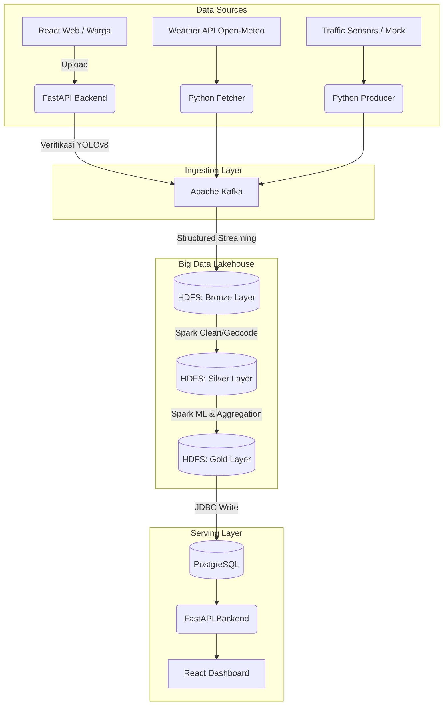

# CPMK-2: Desain Infrastruktur & Justifikasi Teknis

*Dokumen ini disusun khusus untuk memenuhi kriteria "Sangat Baik (A)" pada Rubrik Evaluasi CPMK-2 terkait justifikasi teknis eksplisit dan kelengkapan arsitektur.*

---

## 1. Diagram Arsitektur End-to-End (Medallion Lakehouse)

---

## 2. Justifikasi Teknis Pemilihan Teknologi

Pemilihan teknologi dalam ekosistem SRIS tidak dilakukan secara sembarangan, melainkan didasarkan pada kebutuhan *scalability*, performa, dan karakteristik data:

### A. Ingestion Layer: Apache Kafka
- **Mengapa Kafka?** Sistem SRIS tidak hanya menerima laporan statis, tetapi juga aliran (*stream*) data cuaca dan lalu lintas yang terus-menerus (*high-throughput*). Kafka bertindak sebagai *message broker* yang sangat tangguh (mendukung ratusan ribu *events/sec*).
- **Justifikasi Teknis:** Kafka menyediakan arsitektur *Pub/Sub* terdistribusi dan *fault-tolerant*. Jika *consumer* (Spark) mati, data tidak akan hilang karena Kafka menyimpannya di dalam log secara *persistent*.

### B. Storage Layer: Hadoop HDFS & Apache Parquet
- **Mengapa HDFS?** Digunakan sebagai Data Lake karena kemampuannya menyimpan *Big Data* secara terdistribusi dan *scalable* pada *commodity hardware*.
- **Mengapa Parquet?** Data di Lakehouse SRIS disimpan menggunakan format **Apache Parquet**.
- **Justifikasi Teknis:** Parquet adalah format *columnar storage* (berbasis kolom). Format ini memberikan rasio kompresi yang sangat tinggi (menghemat storage hingga 75%) dan sangat optimal untuk *query* analitik (*read-heavy*), karena mendukung *predicate pushdown* (Spark hanya membaca kolom yang dibutuhkan saat filtering, bukan seluruh baris).

### C. Processing Layer: Apache Spark (PySpark)
- **Mengapa Spark?** Dibandingkan Hadoop MapReduce lama yang terlalu banyak membaca/menulis ke disk, Spark melakukan pemrosesan di dalam memori utama (*in-memory processing*).
- **Justifikasi Teknis:** Spark mendukung **Unified Engine**. SRIS menggunakan *Structured Streaming* untuk layer Bronze (membaca Kafka tanpa jeda), dan *Batch Processing* + *Spark MLlib* untuk layer Silver/Gold secara bersamaan menggunakan satu *codebase* dan API yang sama (DataFrame API).

### D. Serving Layer: PostgreSQL
- **Mengapa PostgreSQL?** Untuk menyajikan metrik analitik (Road Health Index, Priority Score) kepada pengguna akhir (Dashboard React).
- **Justifikasi Teknis:** Walaupun Spark sangat cepat memproses data berukuran TeraByte, ia tidak dirancang untuk melayani ribuan *query* berlatensi rendah (milidetik) dari *frontend/backend*. Hasil perhitungan berat di Layer Gold (HDFS) di-*push* ke PostgreSQL karena RDBMS ini sangat cepat untuk *point-queries* (membaca indeks tertentu untuk UI Dashboard).
